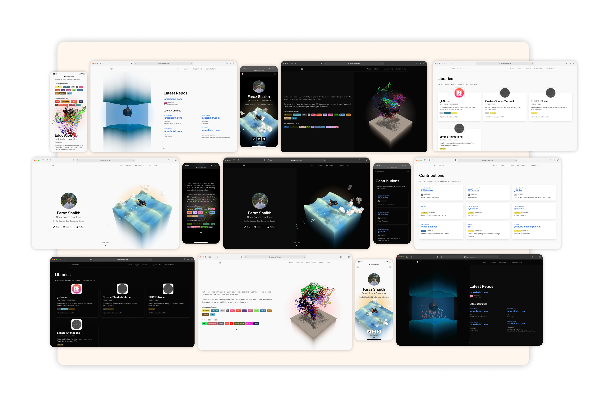

  <h3 align="center">👻</h3>
  <h1 align="center">Home</h1>
    <h3 align="center">farazshaikh.com</h3>
  
  

    This repo contains the code for my portfolio site.
     
    <a href="https://farazshaikh.com">Launch Site</a>
    ·
    <a href="mailto:farazzshaikh@gmail.com">Report Bug</a>
  

  

    My work is for and funded by the community. If you used this or found this helpful consider supporting me.
  

  

    
    
    
     
  

 

    </img>
    Made using Jekyll, so pure HTML, CSS/SCSS and JavaScript

 
